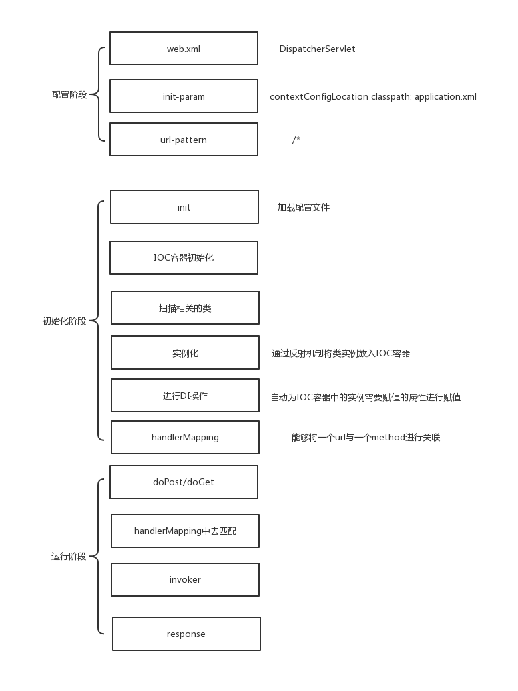

# SimpleSpring
## 手写简单Spring框架
- 配置阶段：主要是完成 application.xml 配置和 Annotation 配置。
- 初始化阶段：主要是加载并解析配置信息，然后，初始化 IOC 容器，完成容器的 DI 操作，已经完成 HandlerMapping 的初始化。
- 运行阶段：主要是完成 Spring 容器启动以后，完成用户请求的内部调度，并返回响应结果。

